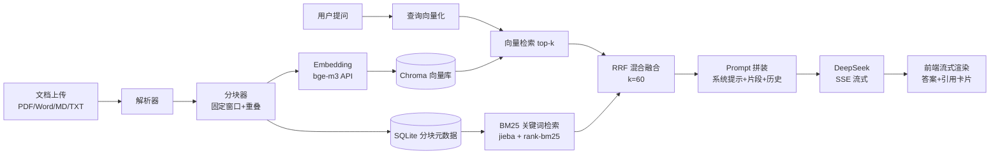

# DocMind — 基于 RAG 的 AI 知识库问答系统

上传文档，问它问题——支持多格式文档（PDF / Word / Markdown / TXT）的知识库问答系统。基于 RAG（检索增强生成）架构：先把文档切块向量化入库，提问时检索最相关的片段，交给大模型结合上下文生成答案，并给出引用来源。

> 核心亮点：**数据驱动的检索质量工程** —— 可插拔的分块/检索策略 + 自建评估体系（recall@k / MRR）+ 压测报告，用数据证明"混合检索为什么更好"。

## 功能特性

- [x] 文档上传与解析：PDF / Word / Markdown / TXT（含 GBK 编码自动探测）
- [x] 固定窗口分块（token 估算）+ 块间重叠
- [x] 向量化入库（Chroma + bge-m3 embedding）
- [x] 检索调试端点（`/api/search`，vector / bm25 / hybrid 三策略）
- [x] 混合检索：BM25（jieba + rank-bm25，随文档增删同步重建）+ 向量 + RRF 融合
- [x] 自写 `MyBM25` 与 rank-bm25 逐分对拍（误差 < 1e-6，见 `tests/test_bm25.py`）
- [x] 重排：bge-reranker-v2-m3 精排候选集（可开关，"宽召回 + 精排序"）
- [x] 检索质量评估：LLM 反向生成测试集（90 条 QA）+ 手写 recall@k / MRR + 36 格网格实验
- [x] 前端「检索台」调试面板：三策略并排对比、两路排名徽章互参
- [x] 流式问答（SSE）+ 多轮对话 + 引用溯源
- [x] 聊天前端：手写 HTML/CSS/JS 单页（书斋主题，零框架零构建）
- [x] provider 可切换（mock 离线压测）+ 分段计时诊断（PERF_LOG）
- [x] 压测报告（locust，含 P50/P95/P99，两场景）
- [x] 部署工件（systemd + nginx 一键脚本，SSE 流式代理配置）

## 技术栈

| 组件 | 选型 |
|------|------|
| 后端 | Python 3.12 + FastAPI + Pydantic v2 |
| 向量库 | Chroma（单机嵌入式，持久化落盘） |
| Embedding | 硅基流动 BAAI/bge-m3（1024 维，免费额度） |
| 关键词检索 | BM25（jieba 分词 + rank-bm25，SQLite 全量重建，自写 `MyBM25` 对拍验证） |
| 混合融合 | RRF 倒数排名融合（k=60） |
| 重排 | BAAI/bge-reranker-v2-m3（cross-encoder 精排候选集，可开关） |
| 检索评估 | 自建测试集（LLM 反向生成 + 人工抽查）+ 手写 recall@k/MRR + 网格实验 |
| 大模型 | DeepSeek（OpenAI 兼容，httpx 手写 SSE 流式客户端） |
| 文档解析 | PyMuPDF / python-docx / charset-normalizer |
| 元数据 | SQLite（标准库） |
| 前端 | 原生 HTML / CSS / JS（单页，无框架） |
| 测试/压测 | pytest（90+ 用例，全离线）/ locust（两场景报告 + 分段计时定位瓶颈） |

## 快速开始

```bash
# 1. 创建环境（Python 3.12）
conda create -n docmind python=3.12 -y
conda activate docmind

# 2. 安装依赖
pip install -r requirements.txt

# 3. 配置 API key
cp .env.example .env
# 编辑 .env，填入 DEEPSEEK_API_KEY 和 SILICONFLOW_API_KEY
# DeepSeek:  https://platform.deepseek.com
# 硅基流动:  https://siliconflow.cn

# 4. 启动
uvicorn app.main:app --reload
# 浏览器打开 http://127.0.0.1:8000/docs 查看接口文档

# Windows 控制台若中文日志乱码，用 UTF-8 模式启动：
# python -X utf8 -m uvicorn app.main:app --reload
```

## 系统架构



## 检索质量评估（数据驱动，非拍脑袋）

**方法**：15 篇技术文档语料 → DeepSeek 按段落反向生成 84 条 QA（含答案出处段落，人工抽查 20%）→ 段落级相关性判定（检索块与出处段落余弦相似度 ≥ 0.8）→ 统一评估子集（58 条在所有分块配置下均可判定的查询）→ 36 格网格实验。指标为手写实现的 recall@k / MRR@10。一条命令复现：

```bash
python -X utf8 -m eval.testset_builder   # 生成/重建测试集
python -X utf8 -m eval.evaluate          # 全量网格（断点续跑，只补缺）
```

**结果**（58 条统一子集，按 recall@10 降序）：

| 配置 | recall@3 | recall@5 | recall@10 | MRR@10 |
|------|----------|----------|-----------|--------|
| chunk256_o0_vector_on | 0.9310 | 0.9655 | 1.0000 | 0.9253 |
| chunk256_o0_bm25_on | 0.9397 | 0.9741 | 1.0000 | 0.9253 |
| chunk512_o0_vector_on | 0.9914 | 1.0000 | 1.0000 | 0.9655 |
| chunk512_o0_bm25_on | 0.9914 | 1.0000 | 1.0000 | 0.9655 |
| chunk512_o0_hybrid_on | 0.9914 | 1.0000 | 1.0000 | 0.9655 |
| chunk512_o50_vector_off | 0.9224 | 0.9655 | 1.0000 | 0.8886 |
| chunk512_o50_vector_on | 1.0000 | 1.0000 | 1.0000 | 0.9569 |
| chunk512_o50_bm25_on | 1.0000 | 1.0000 | 1.0000 | 0.9569 |
| chunk512_o50_hybrid_off | 0.9828 | 0.9914 | 1.0000 | 0.9138 |
| chunk512_o50_hybrid_on | 1.0000 | 1.0000 | 1.0000 | 0.9569 |
| chunk768_o0_vector_off | 1.0000 | 1.0000 | 1.0000 | 0.9540 |
| chunk768_o0_vector_on | 0.9914 | 1.0000 | 1.0000 | 0.9741 |
| chunk768_o0_bm25_on | 0.9914 | 1.0000 | 1.0000 | 0.9741 |
| chunk768_o0_hybrid_off | 0.9828 | 1.0000 | 1.0000 | 0.9690 |
| **chunk768_o0_hybrid_on** | 0.9914 | 1.0000 | 1.0000 | **0.9741** |
| chunk768_o50_vector_off | 1.0000 | 1.0000 | 1.0000 | 0.9511 |
| chunk768_o50_vector_on | 0.9914 | 1.0000 | 1.0000 | 0.9741 |
| chunk768_o50_bm25_on | 0.9914 | 1.0000 | 1.0000 | 0.9741 |
| chunk768_o50_hybrid_off | 0.9828 | 1.0000 | 1.0000 | 0.9690 |
| chunk768_o50_hybrid_on | 0.9914 | 1.0000 | 1.0000 | 0.9741 |
| chunk256_o50_vector_on | 0.8678 | 0.9425 | 0.9943 | 0.8721 |
| chunk256_o0_hybrid_on | 0.9310 | 0.9655 | 0.9914 | 0.9253 |
| chunk512_o0_bm25_off | 0.9741 | 0.9828 | 0.9914 | 0.9195 |
| chunk512_o0_hybrid_off | 0.9741 | 0.9914 | 0.9914 | 0.9345 |
| chunk512_o50_bm25_off | 0.9741 | 0.9828 | 0.9914 | 0.9195 |
| chunk256_o50_bm25_on | 0.8851 | 0.9598 | 0.9885 | 0.8736 |
| chunk256_o50_hybrid_on | 0.8678 | 0.9425 | 0.9856 | 0.8721 |
| chunk768_o0_bm25_off | 0.9828 | 0.9828 | 0.9828 | 0.9368 |
| chunk768_o50_bm25_off | 0.9828 | 0.9828 | 0.9828 | 0.9454 |
| chunk256_o0_bm25_off | 0.8276 | 0.9052 | 0.9741 | 0.8602 |
| chunk256_o0_hybrid_off | 0.8793 | 0.9569 | 0.9741 | 0.8583 |
| chunk512_o0_vector_off | 0.9397 | 0.9569 | 0.9741 | 0.8966 |
| chunk256_o50_hybrid_off | 0.8161 | 0.9310 | 0.9626 | 0.8382 |
| chunk256_o0_vector_off | 0.8362 | 0.9224 | 0.9569 | 0.8520 |
| chunk256_o50_vector_off | 0.7644 | 0.8707 | 0.9483 | 0.8037 |
| chunk256_o50_bm25_off | 0.7931 | 0.8793 | 0.9454 | 0.8279 |

**结论（默认参数据此定稿）**：

1. **重排是最大的单一变量**：小分块下把 recall@3 平均拉升约 10pp（chunk256 bm25 0.83→0.94），大分块下 MRR 仍稳定提升——「宽召回 + 精排序」在本语料上成立；
2. **分块 256 过碎**（段落被切断、上下文不足），512/768 显著更优；768 分块自带充足上下文，与 512 差距在噪声内，重叠收益趋零——默认取 768/0，块数最少、效果相同；
3. **重排开启后三策略趋同**：重排吸收了混合融合的收益，hybrid 在无重排时稳定不输单路——所以默认策略 hybrid + 重排，只赚不亏；
4. 系统默认参数 chunk 768 / 无重叠 / hybrid / rerank on 均来自本表，可随时用 `eval/evaluate.py` 复现。

## 性能压测（locust，两场景）

**口径**：15 篇语料灌库（26 个 chunk，`loadtest/seed_docs.py`）；查询池 = 评估测试集 84 条真实问题；每场景 180 秒，报告为 P50/P95/P99（本机 8 核 Windows，实测值）。

| 场景 | 目的 | provider | 并发 |
|------|------|----------|------|
| 场景 1 端到端延迟 | 真实用户体验（含外部 API 延迟） | 全真实（硅基流动 + DeepSeek） | 3（1~3s 思考） |
| 场景 2 系统吞吐 | 测系统自身极限（排除外部 API） | 全 mock（离线确定性实现） | 50（零思考） |

| 指标 | 场景 1 | 场景 2 |
|------|--------|--------|
| /api/search P50 / P95 / P99 | 630 / 860 / 3400 ms | 130 / 210 / 260 ms |
| /api/chat 首 token P50 / P95 | 1100 / 1500 ms | 80 / 150 ms |
| /api/chat 全量 P50 / P95 / P99 | 2400 / 3700 / 4300 ms | 270 / 380 / 450 ms |
| RPS / 失败率 | ~1.5 / 0%（含思考时间） | search 143 + chat 71（聚合 357）/ 0% |

**分段计时**（PERF_LOG=1，单请求归因；外部 API 延迟含网络往返）：

| 分段 | 耗时 | 类型 |
|------|------|------|
| embed（查询向量化） | 170~240 ms | 外部 API |
| vector_query（Chroma） | ~1.5 ms | 本地 |
| bm25（jieba + 打分） | ~0.2 ms | 本地 |
| db_fetch（SQLite 回填） | ~0.6 ms | 本地 |
| rerank（cross-encoder） | 330~400 ms | 外部 API |
| llm_first_token / llm_total | ~550 / ~1330 ms | 外部 LLM |

**结论**（面试话术）：

1. **延迟大头全在外部 API**：embed + rerank + LLM 首 token 占端到端 ~95%，本地组件（Chroma / SQLite / BM25 / RRF）全部 ≤2ms——检索架构本身没有性能债；
2. **系统自身吞吐足够**：全 mock 50 并发零思考时间，6.4 万请求 0 失败，search 143 rps / chat 71 rps；场景 2 的 P50 主要来自高并发排队（FastAPI 同步端点线程池 40 + `to_thread` 默认线程池），而非计算；
3. **场景 2 检索结果无语义**（mock 哈希向量），但每条代码路径与真实一致，吞吐结论成立；
4. 场景 1 P99 长尾（3.4s）来自免费额度 API 限流与偶发 TLS 重连，商用 key 可消除；优化方向：embed/rerank 改异步 httpx + 共享连接池（现状每次调用新建连接，TLS 握手按次付费）。

**复现**：

```bash
# 灌种子（一次）
python -X utf8 loadtest/seed_docs.py --base http://127.0.0.1:8000
# 场景 1：真实 provider 低并发
python -X utf8 -m locust -f loadtest/locustfile.py --host http://127.0.0.1:8000 \
  --headless -u 3 -r 1 -t 300s --csv=locust_report_scenario1 --html=locust_report_scenario1.html
# 场景 2：全 mock 高并发（服务器用三个 PROVIDER=mock 环境变量启动）
DOCMIND_WAIT_MIN=0 DOCMIND_WAIT_MAX=0.1 python -X utf8 -m locust -f loadtest/locustfile.py \
  --host http://127.0.0.1:8000 --headless -u 50 -r 10 -t 180s --csv=locust_report_scenario2 --html=locust_report_scenario2.html
# 定位瓶颈：PERF_LOG=1 启动服务后发请求，日志输出每段耗时
```

## 部署指南（学生机 2C2G，约 100 元/年）

1. 购买：阿里云「云翼计划」或腾讯云「云+校园」，学生认证后选 2 核 2G、Ubuntu 22.04/24.04
2. 云控制台安全组放行 80 端口
3. 登录服务器执行：

```bash
git clone https://github.com/Maple-in-rain/docmind.git   # 不稳时用 gitee 镜像或 ghproxy 加速
bash docmind/deploy/setup_server.sh                      # 脚本中途会暂停，等你在 .env 填 API key
```

4. 打开 `http://<公网IP>/`；流式输出验证：`curl -N -X POST http://<IP>/api/chat -H "Content-Type: application/json" -d '{"messages":[{"role":"user","content":"你好"}]}'` 应逐帧返回

架构：nginx（80 反向代理，`proxy_buffering off` 保证 SSE 逐字流式）→ uvicorn（127.0.0.1:8000，systemd 守护）→ 嵌入式 Chroma + SQLite（无需额外数据库服务）。常见排查：`journalctl -u docmind -f`、`sudo nginx -t`。**服务器上同样不要提交 .env**（已在 .gitignore）。

## API 摘要

| 方法 | 路径 | 说明 |
|------|------|------|
| POST | `/api/documents/upload` | 上传文档并入库（multipart） |
| GET | `/api/documents` | 文档列表 |
| DELETE | `/api/documents/{doc_id}` | 删除文档（向量+元数据同步清理） |
| POST | `/api/search` | 检索调试（strategy: vector/bm25/hybrid，可选 rerank） |
| POST | `/api/chat` | 聊天，默认 SSE 流式（`stream:false` 返回完整 JSON），支持多轮 |
| GET | `/api/health` | 健康检查 + 统计 |

完整接口文档：启动后访问 `/docs`。

## 项目结构

```
app/
├── api/          # 路由层（薄封装：参数校验 → 调用服务）
├── services/     # 编排层（入库流水线 / 检索 / 问答）
├── parsers/      # 文档解析插件（pdf/docx/md/txt + 注册表）
├── chunking/     # 分块策略插件（固定窗口，标题结构规划中）
├── embeddings/   # 向量化插件（硅基流动 API）
├── retrieval/    # 检索插件（向量库、BM25、RRF 融合）
├── reranking/    # 重排插件（bge-reranker 精排候选集）
├── llm/          # 大模型插件（DeepSeek 流式客户端）
└── storage/      # SQLite 元数据 + 文件落盘

eval/
├── metrics.py          # 手写 recall@k / MRR@k（含单测）
├── evaluate.py         # 网格实验：分块×重叠×策略×重排，一键复现
├── testset_builder.py  # DeepSeek 反向生成测试集
└── data/               # 语料（15 篇技术文档）+ 测试集（90 条 QA）+ 抽查记录

loadtest/
├── locustfile.py       # 压测任务（查询池与评估同源，含首 token 自定义事件）
└── seed_docs.py        # 种子数据：上传语料到运行中的实例

deploy/
├── setup_server.sh     # Ubuntu 一键部署（conda + systemd + nginx + swap）
├── docmind.service     # systemd 守护单元
└── nginx.conf          # 反向代理（SSE 流式：proxy_buffering off）
```

分层原则：**依赖抽象接口，不依赖具体实现** —— 换供应商只需新增插件类 + 改配置。

## Roadmap

- [x] 聊天链路启用重排/混合检索（默认参数来自第 3 周网格实验数据）
- [x] 压测体系 + 分段计时 + 部署工件（第 4 周）
- [ ] BM25 索引磁盘序列化 / 增量合并（当前为 SQLite 全量重建，<100 文档毫秒级）
- [ ] Markdown 标题结构化分块
- [ ] 大文件异步入库（任务队列）
- [ ] 扫描版 PDF OCR
- [ ] 查询改写（多轮指代消解）

## License

MIT
